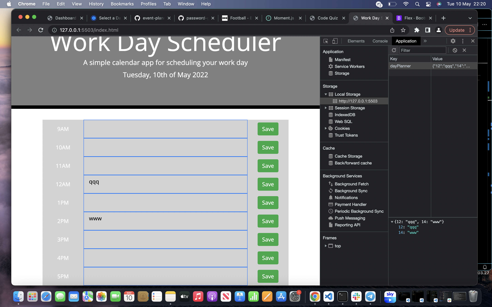

# day-planner-project

day planner with jQuery

# Technologies

HTML
CSS
Javascript
jQuery
momentJS
bootstrap

# HTML

initial page was designed on html with classes and IDs given to specific elements to target them later in JS. snippets were used from bootstrap to help the process.

# CSS

Majority of the styling was conducted via bootstrap to get the general layout of the page and the calender. further CSS was applied and rendered with momentjs to make past, present and future different colours.

# Javascript

used javascript to dynamically render the HTML elements and have functions be called on load of the page. local storage was initialised in order to save the functions which were entered into the planner.

# Screenshots

